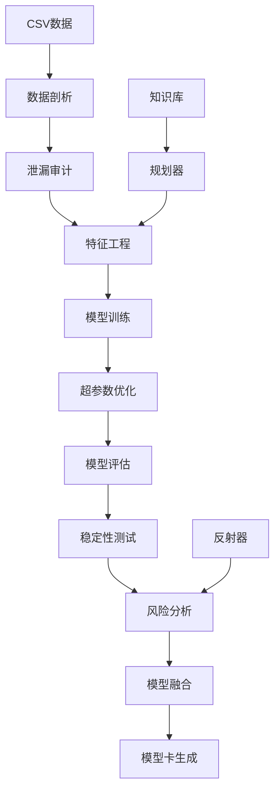

# Tabular Agent v1.0.0

[](https://github.com/li147852xu/tabular-agent/actions)
[](https://codecov.io/gh/li147852xu/tabular-agent)
[](https://badge.fury.io/py/tabular-agent)
[](https://pypi.org/project/tabular-agent/)
[](https://opensource.org/licenses/MIT)

**Tabular Agent** 是一个全自动化的机器学习管道，从CSV数据到模型卡报告的一站式解决方案。它集成了数据剖析、泄漏审计、特征工程、模型训练、超参数优化、模型融合、风险分析和稳定性评估等完整功能。

## 🚀 快速开始

### 安装

```bash
# 基础安装
pip install tabular-agent

# 完整安装（包含所有功能）
pip install tabular-agent[all]

# 开发安装
git clone https://github.com/li147852xu/tabular-agent.git
cd tabular-agent
pip install -e .[dev]
```

### 基本使用

```bash
# 运行完整的ML管道
tabular-agent run \
    --train data/train.csv \
    --test data/test.csv \
    --target target_column \
    --out results/

# 查看帮助
tabular-agent --help
tabular-agent run --help
```

## 📊 完整示例

### 1. 准备数据

首先，我们创建一个示例数据集：

```python
import pandas as pd
import numpy as np

# 创建示例数据
np.random.seed(42)
n_samples = 100

# 生成特征
X = np.random.randn(n_samples, 5)
# 生成目标变量（二分类）
y = (X[:, 0] + X[:, 1] + np.random.randn(n_samples) * 0.1 > 0).astype(int)

# 创建DataFrame
df = pd.DataFrame(X, columns=[f'feature{i+1}' for i in range(5)])
df['target'] = y

# 保存数据
df[:80].to_csv('train.csv', index=False)  # 训练集
df[80:].to_csv('test.csv', index=False)   # 测试集
```

### 2. 运行完整管道

```bash
# 运行完整的ML管道
tabular-agent run \
    --train train.csv \
    --test test.csv \
    --target target \
    --out results/ \
    --verbose
```

### 3. 查看结果

管道运行完成后，会在输出目录生成：

```
results/
└── 20250915_023937/
    ├── meta.json          # 运行元数据
    ├── results.json       # 详细结果
    └── model_card.html    # 模型卡报告
```

### 4. 模型卡报告

打开 `model_card.html` 查看完整的模型卡报告，包含：

- **数据概览**：数据统计、缺失值、数据类型
- **泄漏审计**：时间泄漏、目标泄漏检测
- **特征工程**：特征变换、编码、选择
- **模型性能**：AUC、KS、PR-AUC、R²等指标
- **稳定性分析**：重复运行、方差分析
- **风险分析**：过拟合、泄漏、不稳定性检测
- **规划与引用**：执行计划、历史案例引用

## 🛠️ 高级功能

### 子命令

```bash
# 数据审计
tabular-agent audit \
    --data data.csv \
    --target target_column \
    --out audit_results/

# 模型融合
tabular-agent blend \
    --models model_results/ \
    --out blend_results/ \
    --strategy mean
```

### 高级选项

```bash
# 使用LLM规划器
tabular-agent run \
    --train train.csv \
    --test test.csv \
    --target target \
    --out results/ \
    --planner llm \
    --llm-endpoint https://api.openai.com/v1 \
    --llm-key your-api-key

# 稳定性评估
tabular-agent run \
    --train train.csv \
    --test test.csv \
    --target target \
    --out results/ \
    --stability-runs 10 \
    --calibration isotonic

# 风险策略
tabular-agent run \
    --train train.csv \
    --test test.csv \
    --target target \
    --out results/ \
    --risk-policy conf/risk_policy.yaml
```

## 🏗️ 架构

### 核心组件

- **数据剖析器** (`DataProfiler`): 自动数据质量分析
- **泄漏审计器** (`LeakageAuditor`): 检测数据泄漏
- **特征工程师** (`FeatureEngineer`): 智能特征工程
- **模型训练器** (`ModelTrainer`): 多模型训练与调优
- **模型评估器** (`ModelEvaluator`): 全面性能评估
- **模型融合器** (`ModelBlender`): 集成学习
- **规划器** (`Planner`): LLM+规则混合规划
- **知识库** (`KnowledgeBase`): 历史案例RAG检索
- **反射器** (`Reflector`): 风险分析与建议
- **稳定性评估器** (`StabilityEvaluator`): 模型稳定性测试

### 工作流程



## 📈 性能指标

### 支持的任务类型

- **二分类**: AUC, KS, PR-AUC, F1, Precision, Recall
- **多分类**: 宏平均/微平均F1, 准确率
- **回归**: R², MAE, MSE, RMSE
- **排序**: NDCG, MAP

### 稳定性指标

- **OOF稳定性**: 重复运行方差
- **特征重要性稳定性**: 特征排序一致性
- **预测稳定性**: 预测分布一致性
- **校准稳定性**: 概率校准一致性

## 🔧 配置

### 配置文件

```yaml
# conf/default.yaml
data:
  target: target_column
  time_col: timestamp
  cv_folds: 5

models:
  - lightgbm
  - xgboost
  - catboost

features:
  encoding: target
  scaling: standard
  selection: mutual_info

evaluation:
  metrics: [auc, ks, pr_auc]
  stability_runs: 5
  calibration: isotonic
```

### 风险策略

```yaml
# conf/risk_policy.yaml
overfitting:
  train_test_gap_threshold: 0.05
  cv_std_threshold: 0.02

leakage:
  time_leakage_threshold: 0.8
  target_leakage_threshold: 0.9

instability:
  auc_std_threshold: 0.01
  feature_importance_threshold: 0.3

calibration:
  brier_threshold: 0.25
  reliability_threshold: 0.1
```

## 🐳 Docker支持

```bash
# 构建镜像
docker build -t tabular-agent .

# 运行容器
docker run -v $(pwd)/data:/data -v $(pwd)/results:/results \
    tabular-agent run \
    --train /data/train.csv \
    --test /data/test.csv \
    --target target \
    --out /results/
```

## 🧪 测试

```bash
# 运行测试
pytest tests/ -v

# 运行本地验证
python test_local.py

# 运行修复脚本
./fix_ci.sh
```

## 📚 文档

- [安装指南](docs/installation.md)
- [配置说明](docs/configuration.md)
- [API参考](docs/api.md)
- [故障排除](docs/troubleshooting.md)
- [GitHub Secrets配置](docs/setup-secrets.md)

## 🤝 贡献

欢迎贡献代码！请查看 [CONTRIBUTING.md](CONTRIBUTING.md) 了解详情。

### 开发环境

```bash
# 克隆仓库
git clone https://github.com/li147852xu/tabular-agent.git
cd tabular-agent

# 安装开发依赖
pip install -e .[dev]

# 运行测试
pytest tests/ -v

# 代码格式化
black src/ tests/
isort src/ tests/

# 类型检查
mypy src/
```

## 📄 许可证

本项目采用 MIT 许可证。详见 [LICENSE](LICENSE) 文件。

## 🙏 致谢

感谢以下开源项目的支持：

- [scikit-learn](https://scikit-learn.org/)
- [LightGBM](https://lightgbm.readthedocs.io/)
- [XGBoost](https://xgboost.readthedocs.io/)
- [CatBoost](https://catboost.ai/)
- [Optuna](https://optuna.org/)
- [Pydantic](https://pydantic-docs.helpmanual.io/)

## 📞 支持

- **问题报告**: [GitHub Issues](https://github.com/li147852xu/tabular-agent/issues)
- **功能请求**: [GitHub Discussions](https://github.com/li147852xu/tabular-agent/discussions)
- **文档**: [GitHub Wiki](https://github.com/li147852xu/tabular-agent/wiki)

---

**Tabular Agent v1.0.0** - 让机器学习变得简单而可靠 🚀